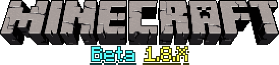
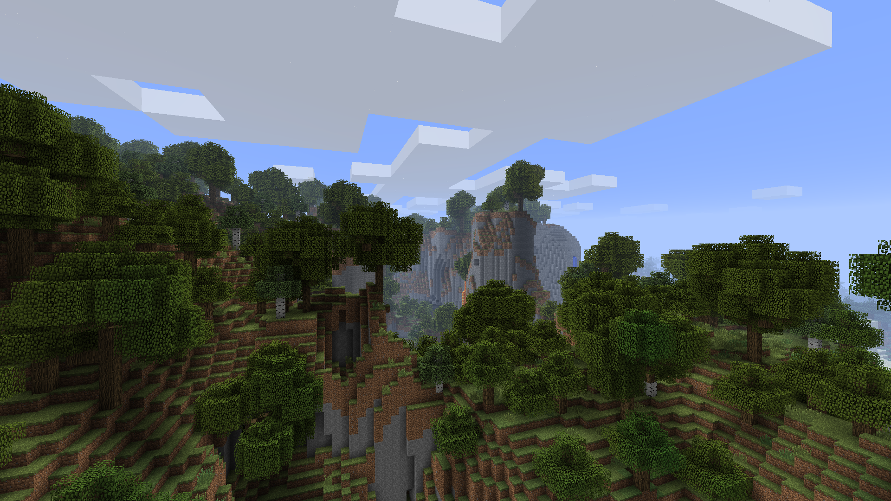
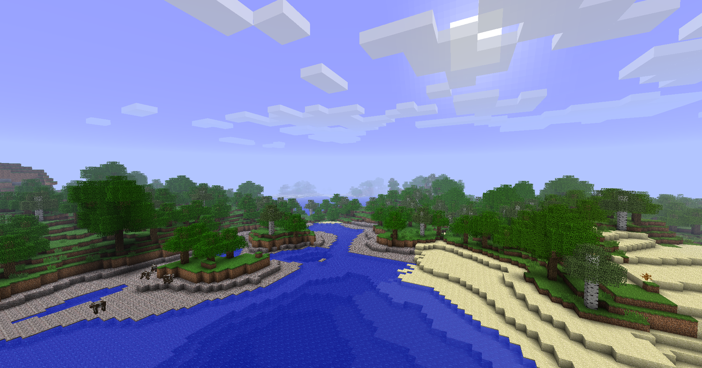
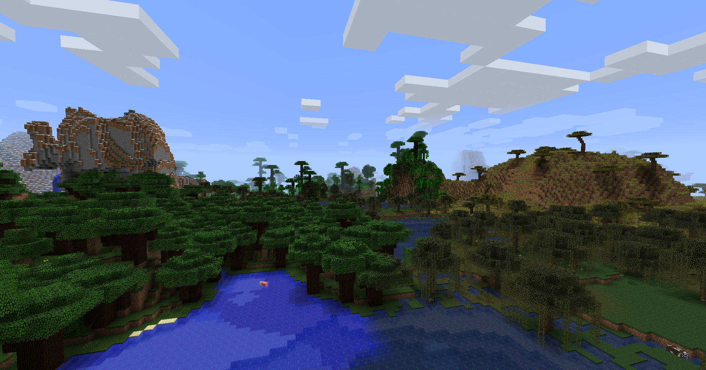
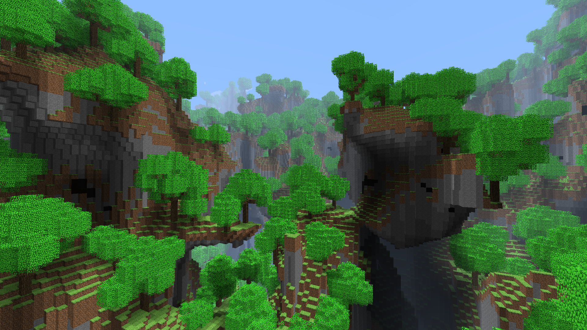
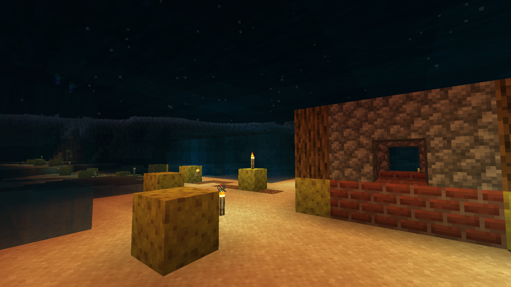

 

    

 

Beta 1.8.X is a mod for Minecraft Beta 1.8.1 that twists and turns the game as you play. This mod features a variety of new world generation, mechanics, items and more taking inspiration from beta, release and pocket edition versions. The mod will slowly descend into chaos as it churns out new versions of the game to play. One day, you'll have hunger and have the ability to spend skill points, but the next day, you have to stop sprinting! Still don't get it? This is basically Super Mario 64's Personalization AI but in Minecraft! B3313 was a large inspiration for this mod.

## Features
- Over 100 options that change over time
- Completely unique experiences every day
- New biomes and other world generation elements
- Occasional horror elements
- Seecret boss battle (read the tips)

## Trailer (Youtube)

## Screenshots

